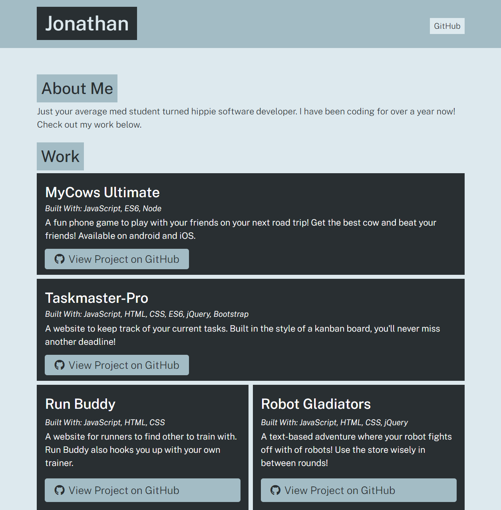

# Portfolio Generator 👨‍💻

## Purpose
A command line app built with Node that will generate a beautiful portfolio website for you without making you do any of the heavy lifting. Let Portfolio Generator make you a beautiful website today!

## Built With
* Node
* Inquirer
* HTML
* CSS
* JavaScript

## How To Use
This app can only be used in the command line. Follow these simple steps to start generating portfolios:

1. Clone this repo
2. Navigate to the app directory
3. Run ```npm install``` to install dependencies
4. Run ```node app``` to start using the app

And that's it!

## Sample Generated Portfolio


## Contribution
Made with ❤️ by Jonathan McDonnell
